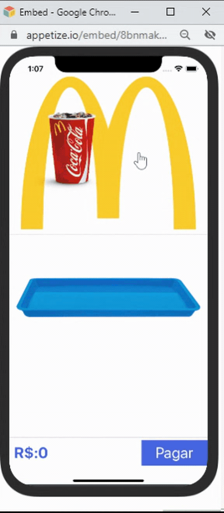

<p align="center">
  
</p>

---

## 🧪 Technologies

This project was developed using the following technologies:

- [React Native-Expo](https://expo.io/)
- [TypeScript](https://www.typescriptlang.org/play#code/Q)
- [Moti Animated](https://moti.fyi/)

## 🚀 Getting started

Clone the project 

```bash
$ git clone https://github.com/LarissaCassel/fast_food_animation_app.git
```

## 💻 Inspiration

- [hui Baby - dribbble](https://dribbble.com/shots/5647210-Fast-food-application)

## 📱 Run on your device

- [Expo Snack](https://snack.expo.dev/@larissacassel/fast_food_aplication)

---
Made  by [LarissaCassel](https://www.instagram.com/larissacassel/?hl=pt) 👋